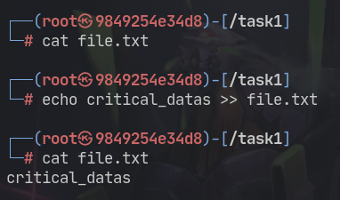
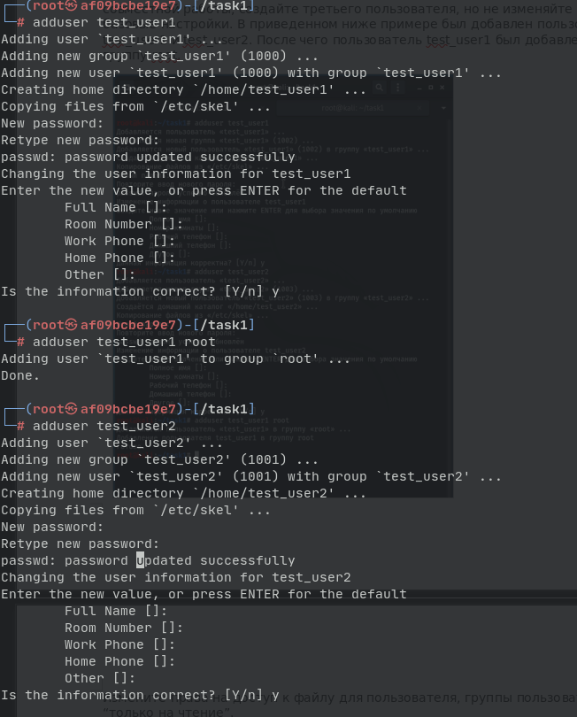
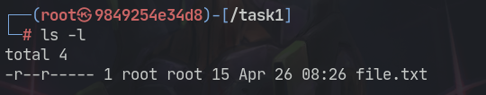
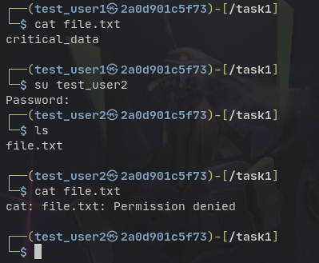
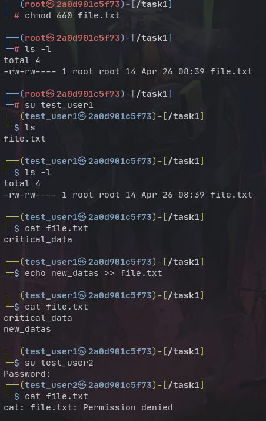
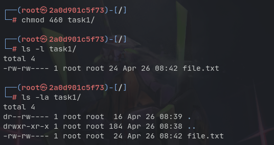
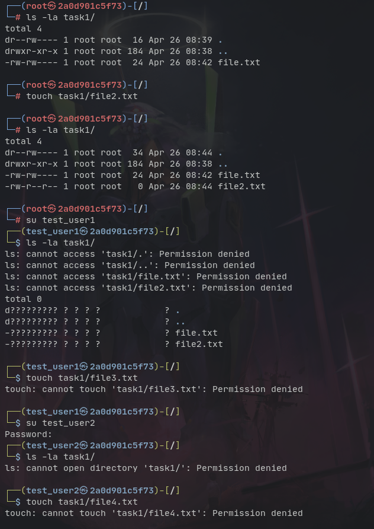

# Лабораторная работа на права доступа
## Кунгуров Макар Евгеньевич

## Задание
Создали файл, задали права доступа на чтение  

Поместили текстовые данные в файл.

Создали двух пользователей, один из которых принадлежит группе root

Отобразили список файлов в папке

Выходит, что только пользователь из группы root имеет права доступа на чтение при коде прав 600

Ставим код прав 660, теперь только администратор и пользователь группы root могут производить запись в файл

Изменяем права директории на код 460, показываем различные аттрибуты команды ls

Теперь только администратор имеет полный доступ к папке, пользователь группы root не может видеть доступ к файлам других пользователей, а так же не может модифицировать файлы. Так же стандартный пользователь не может ни читать, ни писать в папку

