#  Самостоятельно изучить и продемонстрировать способы установки и изменения пароля для входа в компьютер, включая PIN, биометрический и графический/геометрический.

Для задания пароля нужно сделать всего несколько шагов. Открыть
настройки, найти настройки учетной записи и в вариантах входа задать
желаемый пароль.

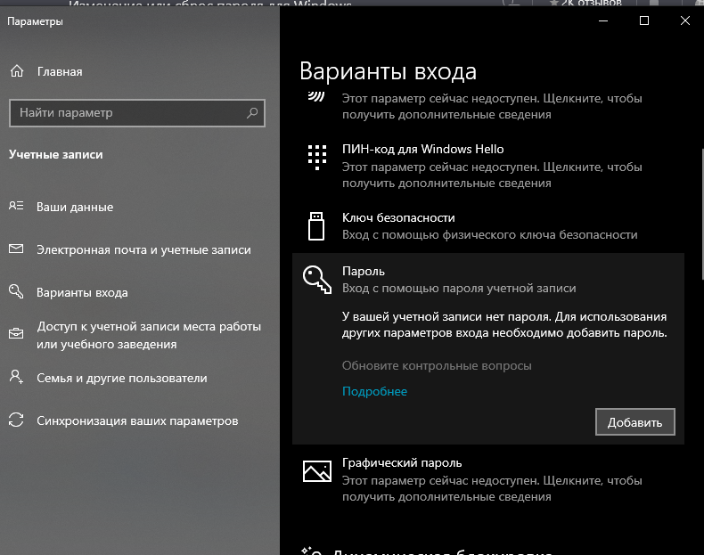{ width=250px }

При нажатии на кнопку «Добавить» появляется окно с заданием пароля и
подсказки (см. рис. 2).

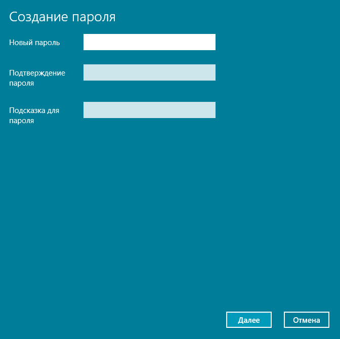{ width=250px }

В том же месте так же можно задать различные варианты паролей. В том
числе и ПИН-код (см. Рис. 3)

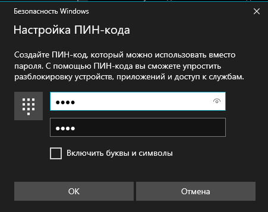{ width=250px }

К сожалению, устройство на котором выполнялась работа не обладает
необходимыми функциями для того, чтобы осветить настройку
биометрического пароля (см. Рис 4, 5).

{ width=250px }

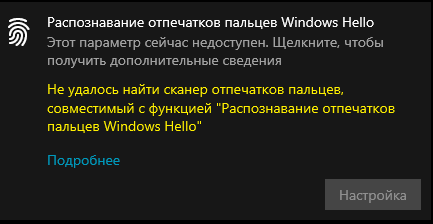{ width=250px }

Активировав графический пароль дальше следует настройка жестов и после
этим способом разблокировки можно спокойно пользоваться (см. Рис. 6).

Необходимо настроить три жеста (круг, прямая, клик). Запомнить их
размер, расположение, направление и их очередность.

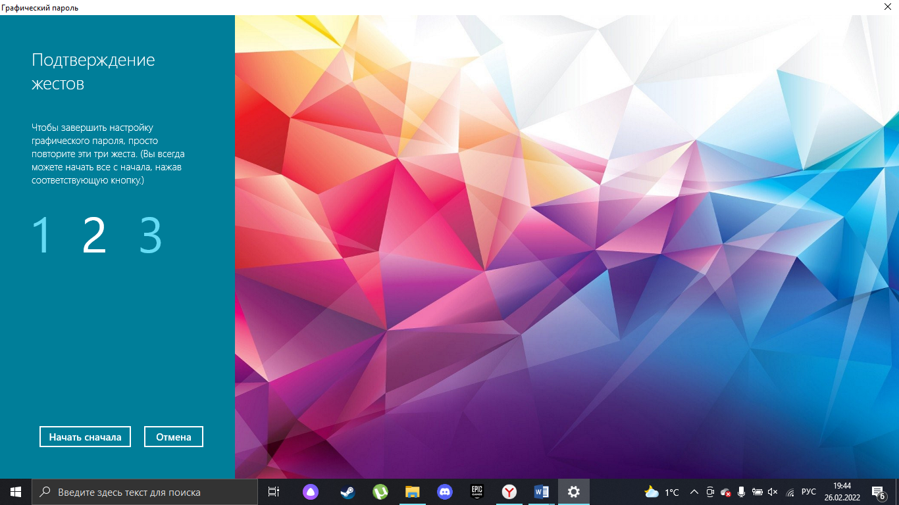{ width=250px }

#  Самостоятельно изучить и применить способы использования пароля для защиты документов MS Office.

Для примера возьмем файл отчета, который прямо сейчас пишется.

Нажав кнопку «Файл», а после на «Защита документа» (см. рис. 7) мы
сможем защитить свой документ от нежелательных глаз. Нажав «Зашифровать
с использованием пароля» и после задаём пароль (см. рис. 8).

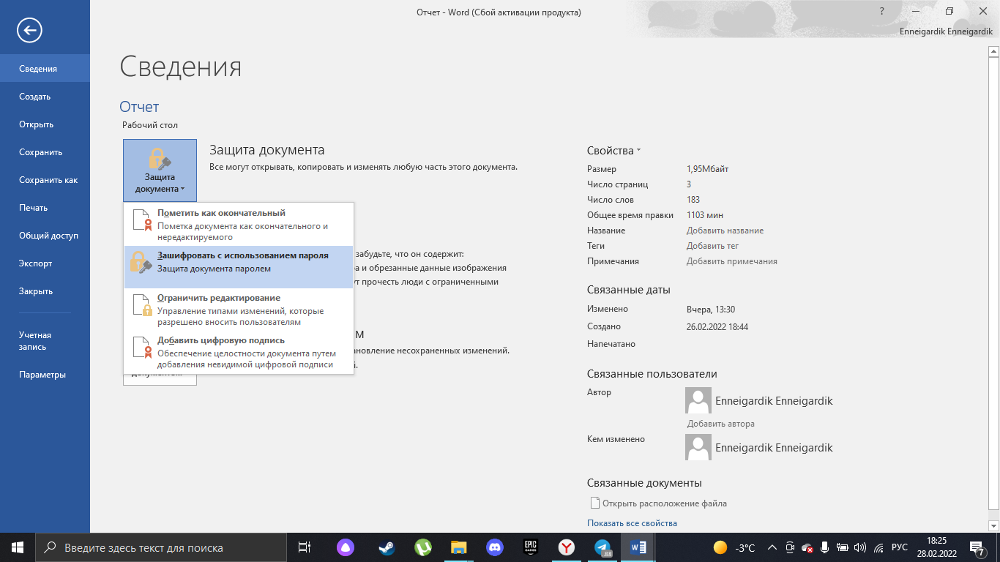{ width=250px }

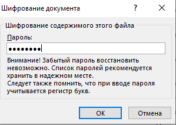{ width=250px }

Теперь без пароля мы не можем просматривать этот документ (см. рис. 9).

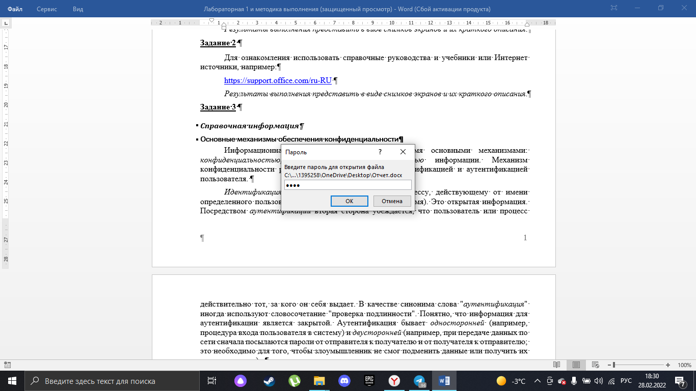{ width=250px }

#  Определить для своего варианта необходимую длину пароля и выполнить автоматическую генерацию пароля из предложенного набора символов (реализовать с помощью электронных таблиц или в любой программной среде по выбору студента).

*Таблица 1*

*Зависимость сложности пароля от используемого набора символов и длины*

| Вариант | P  | V         | T   | Используемые группы символов пароля                        |
|-------------|--------|---------------|---------|----------------------------------------------------------------|
| 2           | 10^-5^ | 3 паролей/мин | 10 дней | Латинские прописные буквы (A-Z) и русские строчные буквы (а-я) |

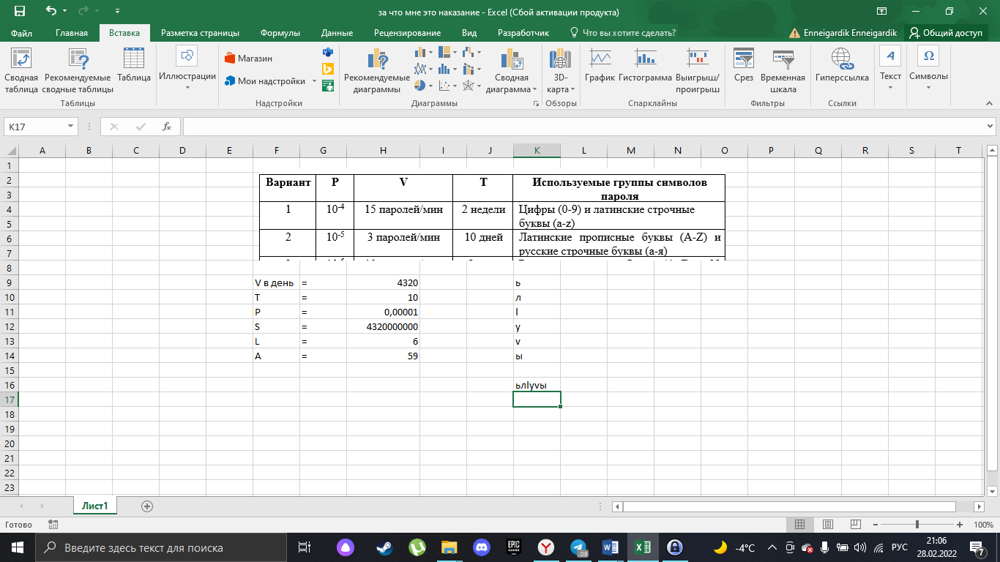{ width=250px }

#  Самостоятельно изучить и применить ПО для хранения паролей.

Мной был выбрана программа для хранения паролей «KeePass» (см. рис. 11).

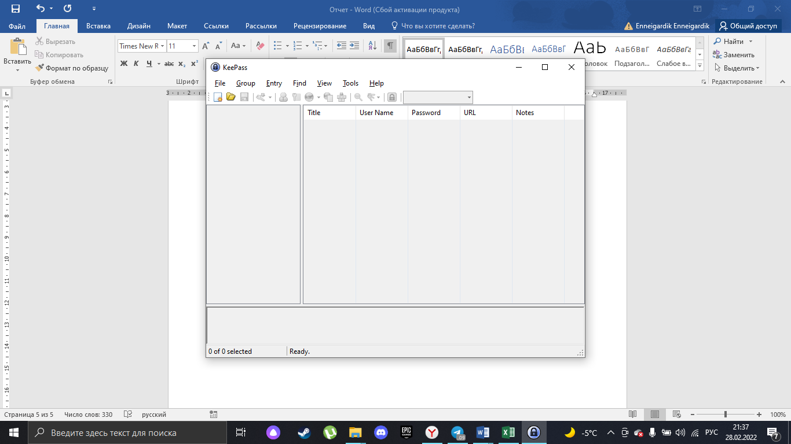{ width=250px }

При создании файла необходимо придумать пароль (см. рис. 12).

Программа имеет встроенный генератор паролей, который можно вызвать,
кликнув на ключик рядом со строкой повтора пароля:

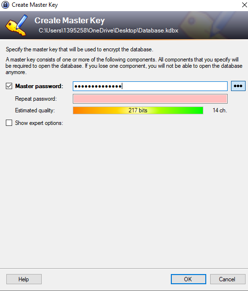{ width=250px }

Итог: Приложение KeePass имеет устаревший внешний вид, открытый исходный
код и портативную версию, которая легко загружается с флешки на любой
компьютер.

Для максимальной защиты, рекомендуется сохранять на личном облаке
портативную версию KeePass и его базу данных. В этом случае
воспользоваться возможностями программы получится без проблем на любом
компьютере. KeePass доступна бесплатно на Android, iOS, mac, Windows и
Linux.

#  Ознакомиться со способами создания USB-ключа безопасности в Windows.

Для создания USB ключа было использовано бесплатное приложение USB
Raptor.

После установки приложения, нужно вставить USB накопитель, ввести и
запомнить пароль, выбрать USB накопитель из списка и нажать кнопку
Create k3y file.

Чтобы начать пользоваться ключом, нужно установить флажок Enable USB
Raptor, чтобы приложение не мешало можно нажать кнопку Minimize to tray.

Если извлечь ключ из компьютера -- появится экран фиолетового цвета с
логотипом приложения, когда ключ будет снова вставлен, компьютер
разблокируется.

Чтобы отключить USB Raptor, нужно убрать, поставленный ранее флажок.

#  Ответить на контрольные вопросы.

1.Идентификация --- процесс распознавания пользователя по его
идентификатору.

Аутентификация -- процедура проверки подлинности, то есть,
доказательство того, что пользователь тот, за кого себя выдает.

2. Пароль должен быть длинным, уникальным для каждого
приложения/аккаунта, пароль не должен быть угадываемым, пароль должен
быть сложным набором из символов разных алфавитов.

Плохие пароли: имена домашних животных, названия, даты.

Хорошие пароли: последовательность символов никак несвязанных между
собой.

3. Вероятность подбора пароля вычисляется по формуле

$P= V*TS$, где P -- вероятность подбора, V -- скорость перебора паролей, T
-- срок действия пароля, S -- количество число возможных паролей длины
L. S вычисляется по формуле: $S=AL$, где А -- мощность алфавита.

4. Можно увеличить количество символов в алфавите или увеличить длину
пароля.

5. Если увеличить значение P, то пароль станет легче подобрать.

Если увеличить значение V и/или T, то вырастет значение P,
следовательно, пароль станет легче подобрать.

P прямо пропорционально значениям V и T.

6. Многофакторная аутентификация -- одновременное использование
нескольких технологий для аутентификации пользователя.

7. Пароли нужно хранить в хорошо зашифрованном виде на внешнем
носителе, к которому нет доступа у нежелательных лиц.

8. Биометрические способы защиты, магическая ссылка, секретный токен.
