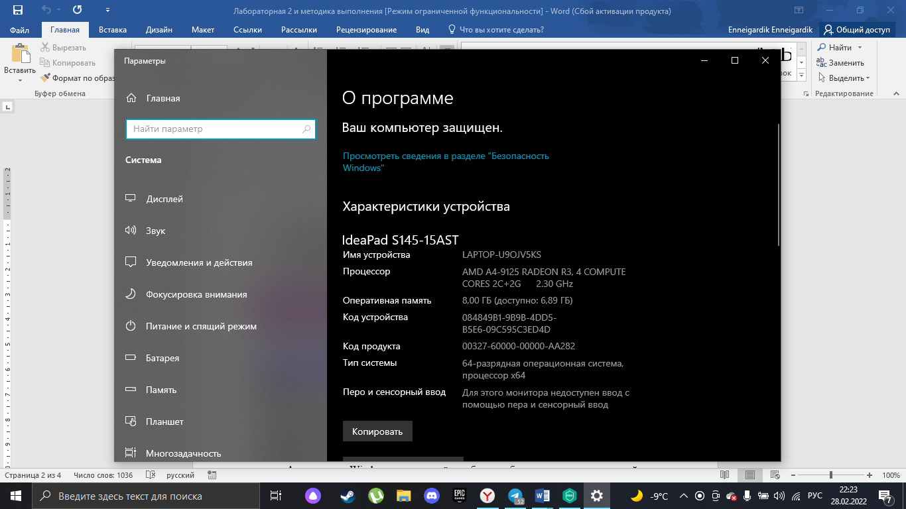
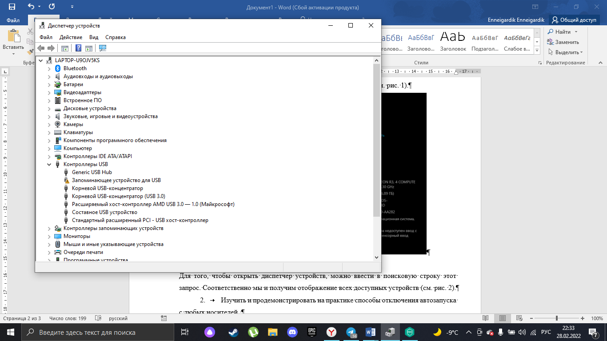
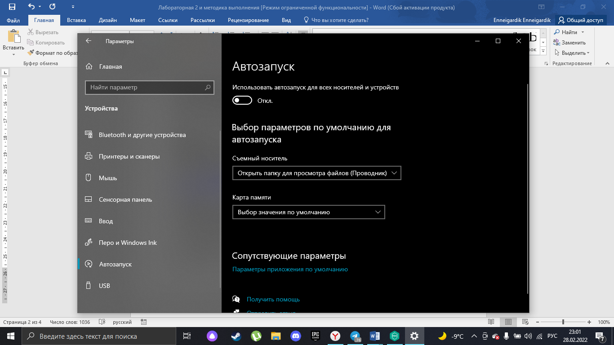
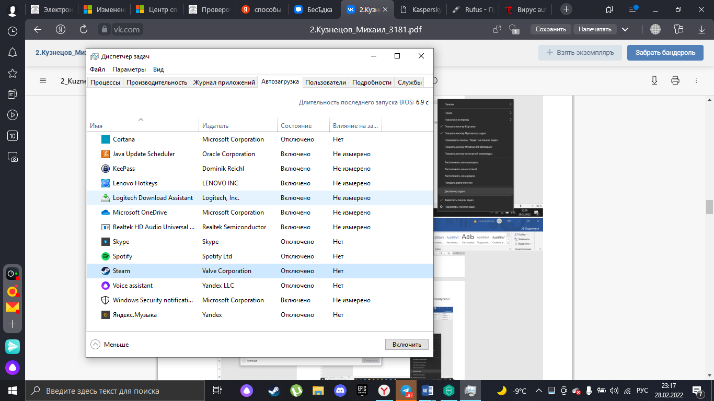
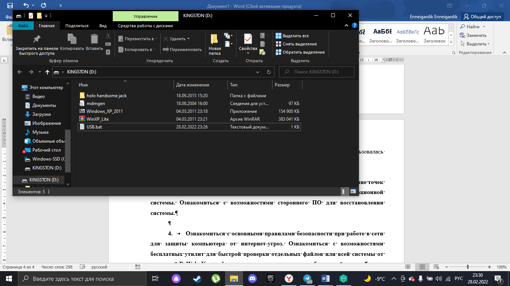
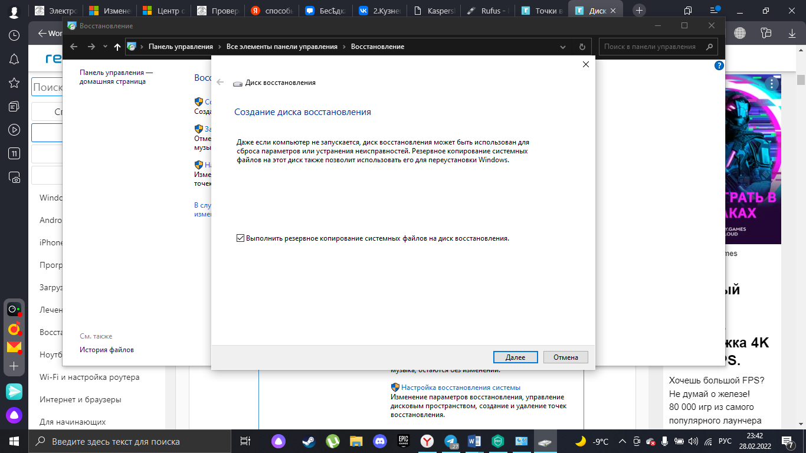
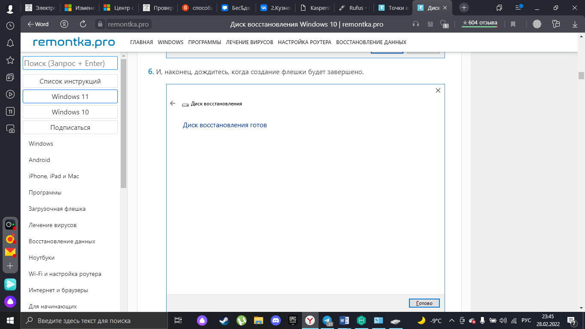
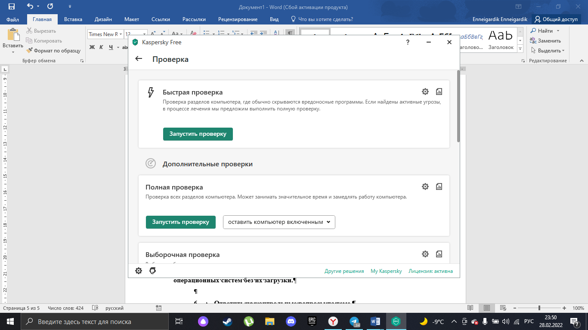
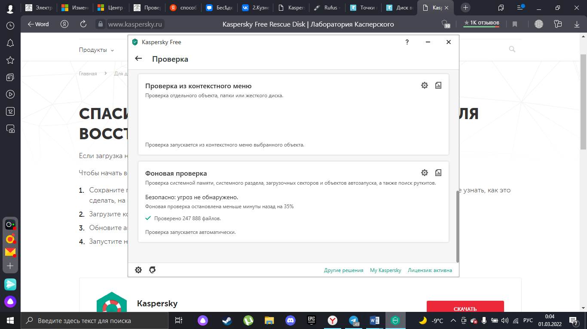
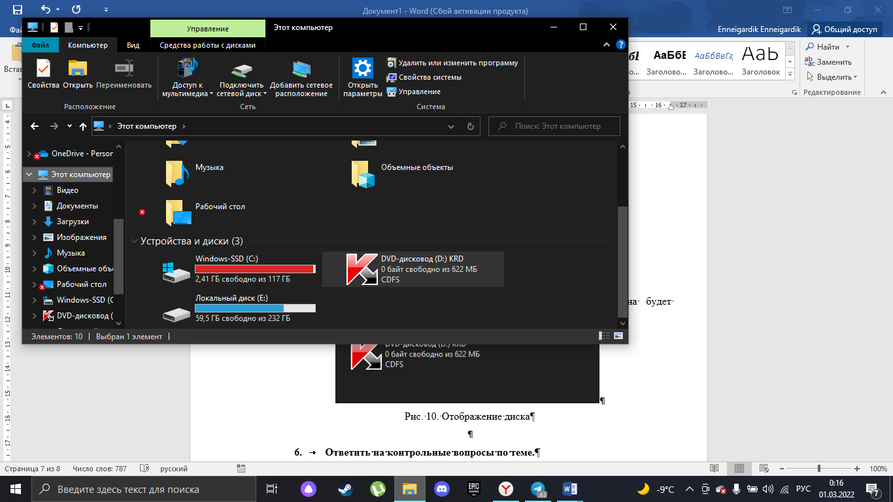

#  Самостоятельно изучить и применить способы определения параметров компьютера с помощью стандартных средств операционной системы и (опционально) с помощью сторонних приложений и программ.

Для того, чтобы найти параметры компьютера я воспользовалась переходом

Проводник> Свойства компьютера.

Теперь можно наблюдать основные данные компьютера (см. рис. 1).

{width=250px,
height=250px,}

Рис.1. Характеристики устройства

Для того, чтобы открыть диспетчер устройств, можно ввести в поисковую
строку этот запрос. Соответственно мы и получим отображение всех
доступных устройств (см. рис. 2).

{width=250px,}

Рис.2. Диспетчер устройств

Так же для просмотра всех устройств можно использовать сторонние
программы, такие как System Info For Windows, или сокращённо SIW.

Рассматриваемая утилита отображает нужные сведения весьма подробно. К
сожалению, не обошлось без недостатков: программа платная, а пробная
версия не только ограничена по времени своего функционирования, но и не
показывает часть информации.

#  Изучить и продемонстрировать на практике способы отключения автозапуска с любых носителей.

В параметрах> устройства> автозапуск, как раз есть возможность
отключить автозапуск.

{width=250px,
height=250px,}

Рис. 3. Отключение автозагрузки дисков

Так же это можно сделать в диспетчере задач (см. рис. 4).

{width=250px,}

Рис. 4. Отключение автозагрузки в диспетчере

Ещё один способ -- создание файла autorun.inf или файл формата .bat. Я
воспользовалась вторым способом (см. рис. 5).

{width=250px,}

Рис. 5. Файл *.bat*, отключающий автозагрузку

После этого избавиться от файла будет невозможно, кроме как полным
форматированием usb носителя.

#  Изучить и применить способы восстановления системы: создание точек восстановления, создание диска восстановления с помощью средств операционной системы. Ознакомиться с возможностями стороннего ПО для восстановления системы.

Сперва идем в раздел восстановления, который находится на панели
управления и нажимает создание диска восстановления (см. рис. 6).

{width=250px,height=250px,}

Рис. 6. Создание диска восстановления

После поиска диска, выбираем желаемый и доступный и ждем, когда диск
будет готов (см. рис. 7).

{width=250px,height=250px,}

Рис. 7. Создание диска восстановления

Windows Repair -- комплексный софт для восстановления работоспособности
операционной системы. Программа выполняет «лечение» системы при сбоях в
работе брандмауэра, ошибках в пакетах обновлений, ограничениях доступа к
системным файлам вирусами, а также восстанавливает работоспособность
некоторых портов. Для повышения безопасности имеется функция очистки
дисков с гибкими настройками.

#  Ознакомиться с основными правилами безопасности при работе в сети для защиты компьютера от интернет-угроз. Ознакомиться с возможностями бесплатных утилит для быстрой проверки отдельных файлов или всей системы от компаний DrWeb, Kaspersky и др. и продемонстрировать работу одной из них.

Kaspersky -- не плохая программа для обнаружения и устранения угроз
безопасности.

Для проверки ПК есть несколько режимов (см. рис. 8).

Быстрая проверка, полная проверка (занимает намного больше времени, на
то она и полная), выборочная проверка и првоерка съемных дисков.

{width=250px,}

Рис. 8. Перечень проверок

Так же существует фоновая проверка (см. рис. 9).

{width=250px,}

Рис. 9. Фоновая првоерка

#  Ознакомиться и продемонстрировать работу бесплатной программы Kaspersky Rescue Disk, которая предназначена для проверки и лечения зараженных операционных систем без их загрузки.

> Официальный сайт имеет довольно понятное объяснение для установки, так
> что пользуясь этим, позволю себе пропустить эту часть и взять
> изображение с сайта (см. рис. 10).

{width=250px,
height=250px,}

Рис. 10. Помощь в установке.

После установки программы на какой-либо внешний носитель она будет
отображаться как отдельный диск (см. рис. 10).

{width=250px,}

Рис. 11. Отображение диска

Kaspersky Rescue Disk - предназначена для проверки и лечения зараженных
операционных систем без их загрузки.

#  Ответить на контрольные вопросы по теме.

1. Для каких целей применяется запрет автозапуска с любых носителей?

2. Как ограничить заражение макровирусом при работе с офисными
приложениями?

3. Перечислите наиболее распространенные пути заражения компьютеров
вирусами.

4. Какие правила при использовании электронной почты следует соблюдать,
чтобы избежать заражения вирусами?

5. Перечислите основные правила защиты от компьютерных вирусов,
получаемых не из вычислительных сетей.

6. Что такое социальная инженерия в контексте информационной
безопасности?

7. Приведите пример применения социальной инженерии для запуска вредоносного ПО или получения несанкционированного доступа к информации и ресурсам информационной системы / локальной сети / отдельному компьютеру.

> 1. Для того чтобы защититься от атак посредством флэшек и других
> носителей.
> 
> 2. Запустить антивирус и просканировать компьютер. Воспользоваться
> загрузочным «аварийным» диском, содержащим антивирус со свежими базами
> (предварительно в BIOS нужно установить загрузку с CD-ROM'а). Загрузить
> антивирус, просканировать винчестер, найденные вирусы будут обезврежены.
> 
> 3. • Основным способом доставки вредоносных программ - шифровальщиков,
> банковских троянов, бэкдоров - по-прежнему остается электронная почта. К
> такому выводу пришли эксперты по кибербезопасности компании Group-IB. •
> Пиратские программы. • Переход по незащищенным ссылкам.
> 
> 4. В основном вирусы по почте проходят под видом документов,
> исполняемых файлов (js и др), в виде ссылки, которая сразу качает вирус
> на компьютер. Надо избегать подозрительных ссылок и файлов.
> 
> 5. Отключить автозапуск носителей создать не удаляющийся autorun.inf 6.
> Подход к выманиваю нужны данных у человека для обхода безопасности
> 
> 6. Социальная инженерия или «атака на человека» --- это совокупность
> психологических и социологических приёмов, методов и технологий, которые
> позволяют получить конфиденциальную информацию. Кибермошенников, которые
> используют эти приёмы на практике, называют социальными инженерами.
> 
> 7. Злоумышленник пробрался на предприятие и использовал usb устройство
> с вредоносным файлом в корпоративной сети, тем самым саботируя
> предприятие.
> 
> Так же хорошим примером может послужить звонки от мошенников, что
> представляются сотрудниками банков.
