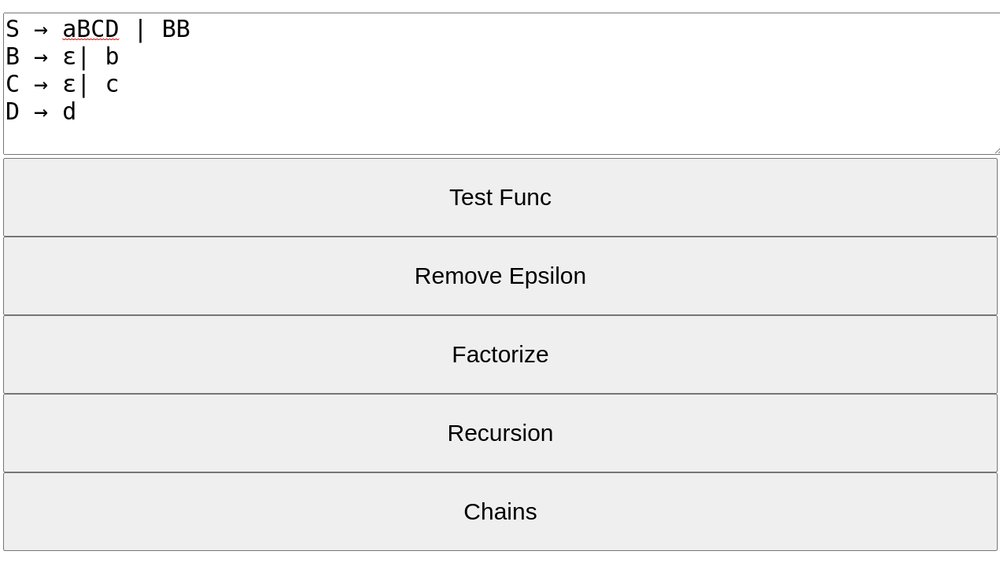
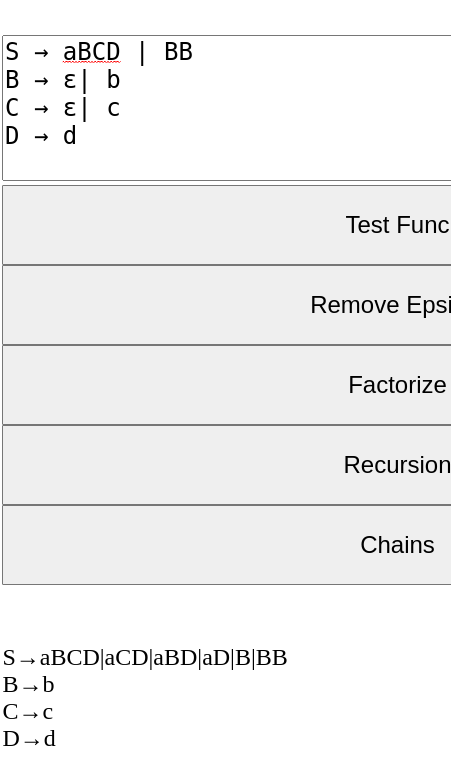
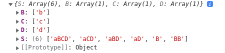

# Грамматический преобразователь

## Специально для вуза
Автор: Кунгуров Макар Евгеньевич  
Группа: 3181  
Предмет:Теория автоматов и формальных языков  
Приложение js + html
# Основные пункты:
- Интерфейс
- Данные
- Алгоритмы
  - Удаление недостижимых нетерминалов
  - Удаление e - правил
  - Устранение непроизводящих правил
  - Устранение цепных правил
  - Устранение левосторонней рекурсии
  - Факторизация правил

## Интерфейс
Интерфейс приложения состоит из поля ввода правил и кнопок, выполняющих соответствующие пребразования. Пользователь должен вписать в поле правила вида:

>Нетерминал1→правило|правило|...  
>Нетерминал2→правило|правило|...  
>Нетерминал3→правило|правило|...  
>...

Ниже приведен пример ввода, первое правило всегда S:

После нажатия на кнопки, пользователь получит результат в текстовом формате:


## Данные
За основу были взяты лекции и семинары по предмету ТАиФЯ. Предпочтительным типом данных оказались словари js, их можно легко импортировать через формат json, легко обрабатывать, легко экспортировать и расширять.
Каждый набор правил - это объект по своей структуре, где правило-нетерминал - это ключ объекта, а его значение - массив выводов правила.


конструктор объекта - списка правил:
```js
  constructor(rule_template) {
    switch (rule_template) {
      case rule_template == null: throw new Error("Null");
      case typeof rule_template == 'object': this.ruleObj = rule_template;
       case typeof rule_template == 'string': this.ruleObj = JSON.parse(rule_template);
    }

  }
```
функции преобразования списка правил в JSON и обратно:
```js

function ruleFromText(ruleText) { //преобразование текста в JSON 
  newObj = {};
  ruleText = ruleText.split(" ").join("");
  let ruleMas = ruleText.split(/\n/).map(rule => rule.split("→"));
  ruleMas.forEach(rule => {
    newObj[rule[0]] = rule[1].split("|");
  });
  return newObj;
}

function printRules(object) { // преобразование JSON в текст правил
  let rulesString = "\n";
  Object.keys(object).forEach(element => {
    if (object[element]) {
      rulesString += element + "→" + object[element].join("|") + "\n";
    }
  });
  rulesString += "\n"
  document.getElementById("answer").innerText += rulesString;
}

```
Экстракторы полезных данных из правил функции говорят сами за себя:
```js 

get first_rule() { return this.rule_template.match(/[A-Z]/)[0] }

get terminals() { return new Set(this.rule_template.match(/[a-z]/g)); };
get non_terminals() { return new Set(this.rule_template.match(/[A-Z]/g)); }
get non_providers() { return new Set([...this.terminals].filter(x => !this.providers.has(x))); }

get epsilons() {
  let epsilons = new Set();
  for (let rule in this.ruleObj) {
    if (this.ruleObj[rule].join('').includes('ε')) { epsilons.add(rule); }
  }
  return epsilons;
}

get reachable() {
  let reachable = [];
  reachable.push(this.first_rule);
  for (let rule in this.ruleObj) {
    // console.log(this.ruleObj[rule].join('').match(/[A-Z]/g));
    this.ruleObj[rule].forEach(sus => {
      reachable.push(sus.match(/[A-Z]/g));
    })
  }
  let final = new Set(reachable.flat(2).filter(n => n));
  return final
}

get un_reachable() { return new Set([...this.terminals].filter(x => !this.reachable.has(x))); }
```
## Алгоритмы
### Удаление недостижимых нетерминалов

```js 
//Получаем все терминалы 
get terminals() { return new Set(this.rule_template.match(/[a-z]/g)); };

//Извлекаем достижимые
get reachable() {
  let reachable = [];
  reachable.push(this.first_rule);
  for (let rule in this.ruleObj) {
    this.ruleObj[rule].forEach(sus => {
      reachable.push(sus.match(/[A-Z]/g));
    })
  }
  let final = new Set(reachable.flat(2).filter(n => n));
  return final
 }

//Создаем новый объект, в который мы вносим только достижимые
remove_unreachable() {
  let newObj = {};
  newObj[this.first_rule] = this.ruleObj[this.first_rule];
  for (let left_rule in this.ruleObj) {
    console.log(left_rule);
    if (this.reachable.has(left_rule)) {
      newObj[left_rule] = this.ruleObj[left_rule];
    }
  }
  this.ruleObj = newObj;
  return this;
}
```
### Удаление е - правил
```js 
// Правила, содержашие эпсилоны
get epsilons() {
let epsilons = new Set();
for (let rule in this.ruleObj) {
  if (this.ruleObj[rule].join('').includes('ε')) { epsilons.add(rule); }
}
return epsilons;
}


remove_epsilon_rules() {
for (let left_rule in this.ruleObj) {
// Поиск и удаление правил
  let n = [];
  this.ruleObj[left_rule].forEach((rule) => {
    let k = rule.split('');
    rule.split('').forEach((symbol, index, splitrule) => {

      if (this.epsilons.has(symbol)) {
        let l = [...splitrule];
        l[index] = null
        k[index] = null;
        n.push(l.join(''))
      }
      if (k.join('').length > 0) n.push(k.join(''))
      else n.push('ε');
    })
    n.push(rule);
  })
  this.ruleObj[left_rule] = [... new Set(n)];
}

// Проверка первого правила
  if (this.epsilons.has(this.first_rule)) {
    let dummy = 0;
    for (let left_rule in this.ruleObj) { if (this.ruleObj[left_rule].join("").split("").includes(this.first_rule)) dummy = 1; }
    if (dummy) {
      let n = this.ruleObj[this.first_rule].filter((rule) => { if (rule != "ε") return rule });
      this.ruleObj[this.first_rule] = n;
      this.ruleObj["Z"] = [this.first_rule, "e"]
      this.first_rule = "Z";
    }
  }

  // обновление объекта
  for (let left_rule in this.ruleObj) {
    this.ruleObj[left_rule].forEach((rule) => {

      let k = this.ruleObj[left_rule].filter((rule) => { if (rule != "ε") return rule });
      this.ruleObj[left_rule] = k;
    })
  }
  return this;
}
```

### Устранение цепных правил
### Факторизация правил
```js 
// Поиск правил для факторизации (ввод - длинна правил и для какого правила применять)
  find_factorize(len, left_rule) {
    let simObj = {}
    for (let i = 0; i < this.ruleObj[left_rule].length - 1; i++) {
      let first = this.ruleObj[left_rule][i]
      let left_substring = first.substr(0, len)
      let similar_arr = [];
      similar_arr.push(first.substr(len))
      for (let j = i + 1; j < this.ruleObj[left_rule].length; j++) {
        let second = this.ruleObj[left_rule][j]
        // console.log(second);
        if (left_substring == second.substr(0, len) && left_substring.length >= 1) {
          // console.log("sus")
          if (second.substr(len).length + 0 && !similar_arr.includes(second.substr(len))) similar_arr.push(second.substr(len));
        }
      }
      if (similar_arr.length > 1 && !simObj[first.substr(0, len)]) {
        simObj[first.substr(0, len)] = similar_arr;
      }
    }
    return simObj;
  }
// Замена правил факторизованными
  replace_factor(len, left_rule) {
    let simObj = this.find_factorize(len, left_rule);
    let replaceObj = {}

    for (let left_rule in simObj) {
      let sym = this.random_symbol;
      replaceObj[left_rule] = sym;
      this.ruleObj[sym] = simObj[left_rule];
    }
    let n = []
    for (let i = 0; i < this.ruleObj[left_rule].length; i++) {
      let rule = this.ruleObj[left_rule][i]
      let subsritng = rule.substr(0, len)
      if (replaceObj[subsritng]) {
        n.push(rule.substr(0, len) + replaceObj[subsritng])
      }
      else n.push(rule);
    }
    this.ruleObj[left_rule] = n;
    return this;
  }

// Проход по всем правилам языка
  replace_factorize() {
    for (let left_rule in this.ruleObj) {
      this.replace_factor(1, left_rule);
    }
    return this;
  }
```
